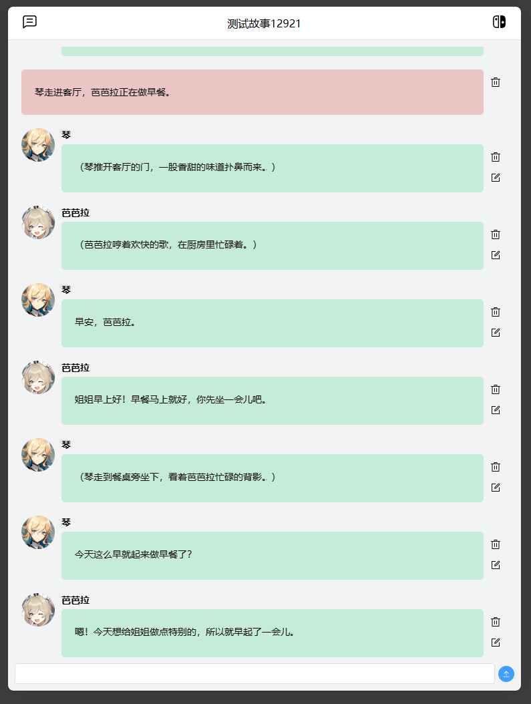

# 项目简介

一个用于与生成式AI交互创作故事的应用。

功能：
- 简陋的界面和用户校验、兼容移动端
- 新建故事、设置故事背景
- 在故事下新建角色、设置角色信息、设置角色头像
- 新建故事下的会话
- 与模型轮流推进故事
- 编辑、删除任何模型已输出的故事情节（更简单地控制模型接下来的输出）

示例：


## 安装和运行指南

### 前端部署

本项目的前端使用Vue.js框架开发，以下是启动和部署前端代码的步骤：

1. 进入前端项目目录：
   ```bash
   cd frontend
   ```
2. 安装依赖：
   ```bash
   npm install
   ```
3. 运行开发服务器（用于开发测试）：
   ```bash
   npm run serve
   ```
4. 生产环境打包：
   ```bash
   npm run build
   ```
5. 根据 `env.example` 文件创建 `.env` 文件，并在其中配置后端接口地址。

### 后端部署

后端支持Docker容器化部署，以下是使用Docker部署后端的步骤：

1. 进入后端项目目录：
   ```bash
   cd backend
   ```
2. 使用Docker Compose启动服务：
   ```bash
   docker-compose up -d
   ```
3. 在自动生成的 `.env` 文件中配置API Key和代理（如果需要的话）

如果选择不使用Docker进行部署：

1. 进入后端项目目录：
   ```bash
   cd backend
   ```
2. 手动根据 `env.example` 文件创建 `.env` 文件，在其中配置mysql数据库连接信息（数据库名称、用户名和密码）、API Key和代理（如果需要的话）
3. 运行yii migration：
   ```bash
   yii migrate
   ```
4. 选择你喜欢的Web服务器进行配置

备注：
- 默认用户token为 `8nD5k1hopW`
- 后端默认使用Gemini 1.5 Pro模型，如需使用其他模型，请重写 `backend/components/LLM` 并修改 `backend/config/LLM` 中的相关配置。

## 许可证

本项目的前端和后端（自开发部分）代码均采用MIT许可证发布。许可证全文位于项目根目录下的 `LICENSE` 文件中。

### Yii2框架许可证

后端使用了Yii2框架，Yii2框架的许可证文本位于后端代码目录下的 `LICENSE` 文件中。详情请参阅该文件。

## 贡献

欢迎开发者为本项目贡献代码。请提交Pull Request或为项目提出Issues。